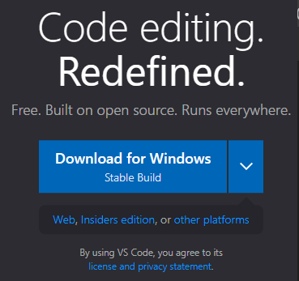
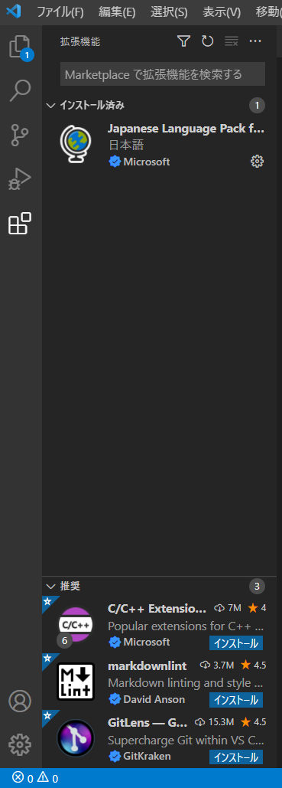
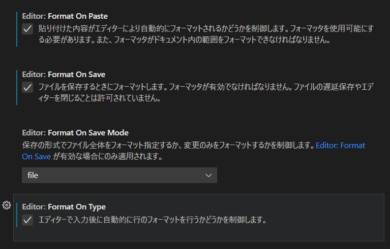
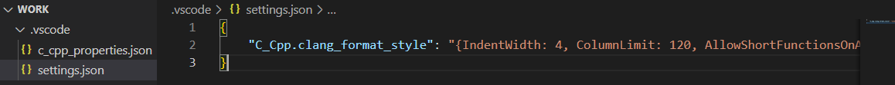
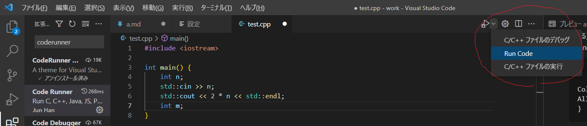

# Visual Studio Code の設定

## vscodeのインストール
[vscodeのページ](https://code.visualstudio.com/)からDownload for Windowsをクリックしてインストールする。



## C++を使うための設定
### 赤波線とか、補完とか
```ctrl``` + ```shift``` + ```x```からC/C++ Extension Packをインストールする。


### 自動フォーマット
```ctrl``` + ```,```で設定を開いて、```format on```と入力する。  
Format On Paste, Format On Save, Format On Typeをクリックする。


作業フォルダを作成し、ファイル→フォルダを開くから開き（ここではworkとしている）その中にフォルダ .vscode を作り、その中に settings.json を作る。settings.jsonには以下を書き込む。

```
{
    "C_Cpp.clang_format_style": "{IndentWidth: 4, ColumnLimit: 120, AllowShortFunctionsOnASingleLine: 'None'}"
}
```


フォーマットスタイルは宗派が存在するため、各自設定してほしい。   
[参考リンク](https://yasuharu519.hatenablog.com/entry/2015/12/13/210825)


## Code Runner の勧め

様々な言語の のコンパイル & 実行をワンクリックで行ってくれる拡張。
```ctrl``` + ```shift``` + ```x```から Code Ruuner をインストールする。  
```ctrl``` + ```,```で設定を開いて、
* Code-runner: Ignore Selection
* Code-runner: Run In Terminal
* Code-runner: Save File Before Run
 
に全てチェックを入れる。  
あとは三角をクリックすると実行できる。
